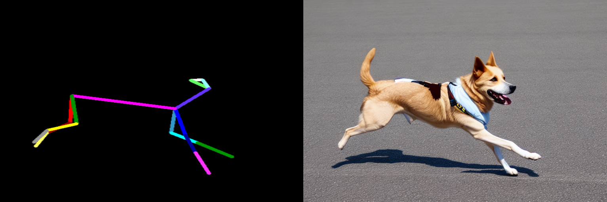
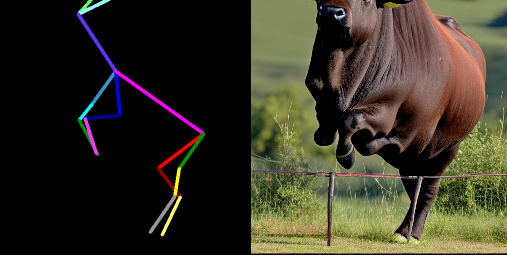
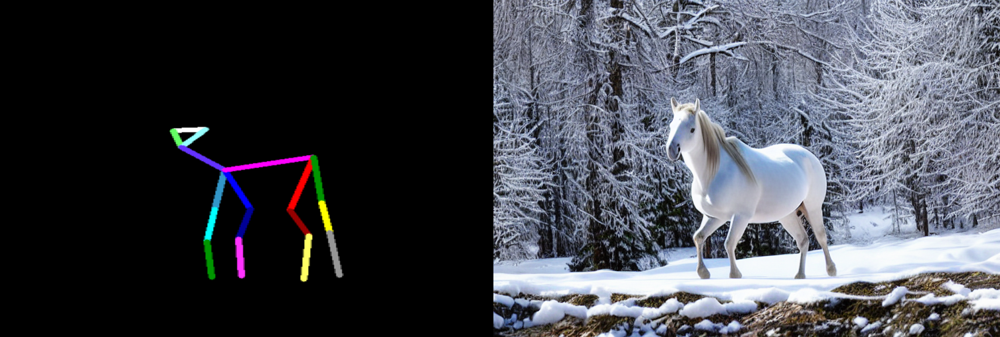
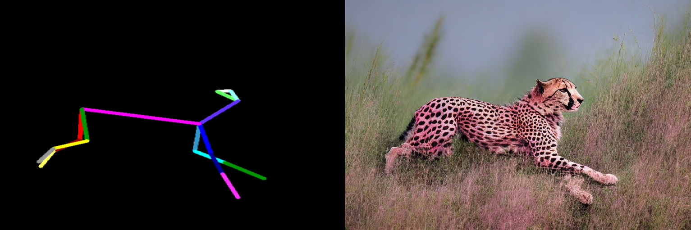
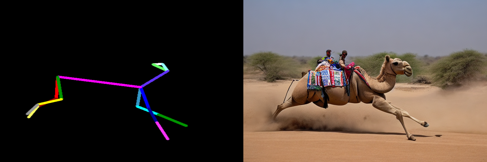
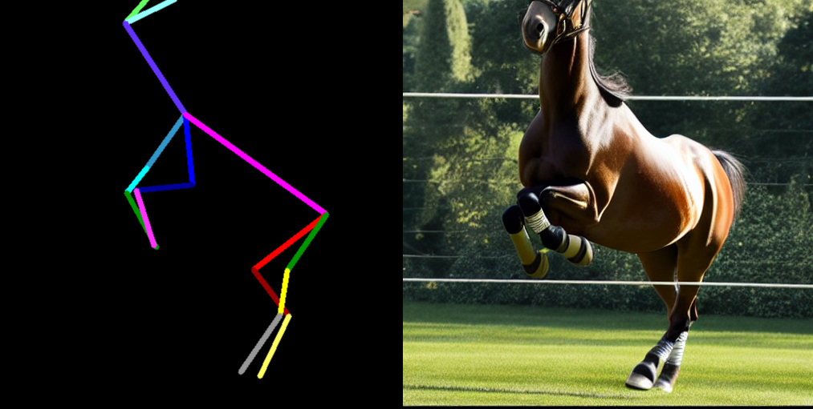
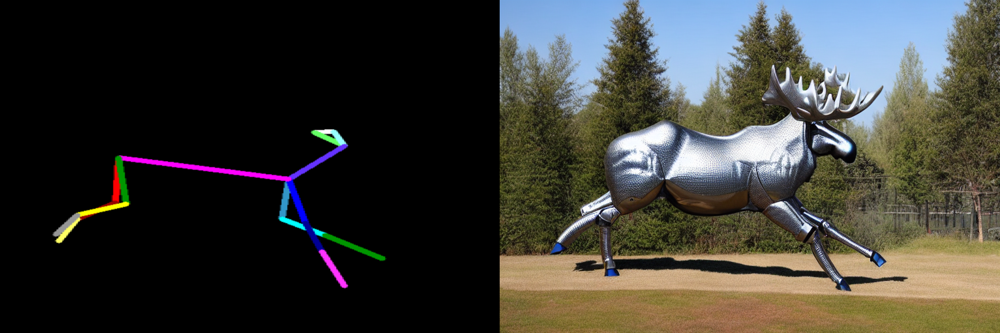

# Animal Pose Control for ControlNet

<!-- [ControlNet 1.1](https://github.com/lllyasviel/ControlNet-v1-1-nightly) is released. Those new models will be merged to this repo after we make sure that everything is good. -->

I trained this model for a final project in a grad course I was taking at school.  
If you want to learn more about how this model was trained (and how you can replicate what I did) you can read my paper in the github_page directory.
Note that the email referenced in that paper is getting shut down soon since I just graduated.  My new email is dbooth@alumni.princeton.edu.


More pictures shown at the end of this file.

# Installation

This installation guide assumes you already have a Conda Environment set up with torchvision, cudatoolkit, and pytorch which works for GPU compute on your system.

Create a new Conda Environment called 'ControlPose' by using the provided environment.yaml file. (or set them up from scratch).  Now activate this environment ('conda activate ControlPose') and install whatever torchvision, cudatoolkit, and pytorch packages you have working in your Conda pytorch environment. Now follow the installation instructions for MMPose (https://mmpose.readthedocs.io/en/latest/installation.html).

If you are having trouble with this step try installing ControlNet by itself using the ControlNet documentation.  Once you get this environment working, continue to the following steps.

In short to install MMPose, run these commands: 

```
pip install -U openmim
mim install mmengine
mim install "mmcv>=2.0.0"
mim install "mmdet>=3.0.0"
cd ~
git clone https://github.com/open-mmlab/mmpose.git
cd mmpose
pip install -r requirements.txt
pip install -v -e .
```

Note that the MMPose repo should be cloned to your home directory.

Now download these files into the './models' directory:

https://huggingface.co/runwayml/stable-diffusion-v1-5/resolve/main/v1-5-pruned.ckpt

https://drive.google.com/file/d/1Q0lvCVFx2hGlgI7Q-npJKDFqZRwZltYY/view?usp=share_link 
(pip install gdown if you want to easily download this model from drive)

https://download.openmmlab.com/mmpose/v1/projects/rtmposev1/rtmpose-m_simcc-ap10k_pt-aic-coco_210e-256x256-7a041aa1_20230206.pth

Now that MMPose is installed you should be ready to run the Animal Pose Control Model demo.  Just run animal_pose2image.py in this repo's root directory and it should load a locally hosted webpage where you can upload any image of an animal as a control input and run inference using it.

Note that the MMPose model used to infer animal poses will have trouble inferring for close-up images of animals or images where not all limbs are present.  Please carefully look at the generated control input skeleton if your inference has unexpected results as this may simply be because MMPose was unable to accurately predict the pose of you input image.

Also note that the MMPose model used to infer animal poses will, in this current version, only work on images with a single animal in them (albeit the model is trained on multi-animal inputs).  If you wish to run inference on a multi-animal input you will need to make your own custom control input skeleton(s) and disable the image preprocessing step in animal_pose2image.py.  

# Gallery









# Citation

    @misc{zhang2023adding,
      title={Adding Conditional Control to Text-to-Image Diffusion Models}, 
      author={Lvmin Zhang and Maneesh Agrawala},
      year={2023},
      eprint={2302.05543},
      archivePrefix={arXiv},
      primaryClass={cs.CV}
    }

[Arxiv Link](https://arxiv.org/abs/2302.05543)
